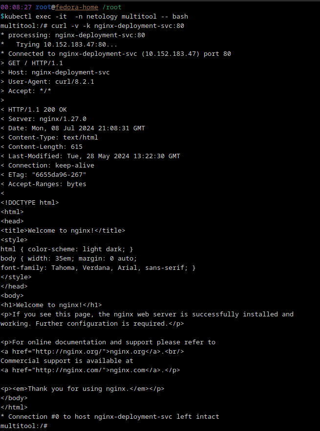

# Домашнее задание к занятию «Запуск приложений в K8S»

### Цель задания

В тестовой среде для работы с Kubernetes, установленной в предыдущем ДЗ, необходимо развернуть Deployment с приложением, состоящим из нескольких контейнеров, и масштабировать его.

------

### Чеклист готовности к домашнему заданию

1. Установленное k8s-решение (например, MicroK8S).
2. Установленный локальный kubectl.
3. Редактор YAML-файлов с подключённым git-репозиторием.

------

### Инструменты и дополнительные материалы, которые пригодятся для выполнения задания

1. [Описание](https://kubernetes.io/docs/concepts/workloads/controllers/deployment/) Deployment и примеры манифестов.
2. [Описание](https://kubernetes.io/docs/concepts/workloads/pods/init-containers/) Init-контейнеров.
3. [Описание](https://github.com/wbitt/Network-MultiTool) Multitool.

------

### Задание 1. Создать Deployment и обеспечить доступ к репликам приложения из другого Pod

1. Создать Deployment приложения, состоящего из двух контейнеров — nginx и multitool. Решить возникшую ошибку.
Чтобы не получить ошибку при запуске ```Deployment``` прочитал  документацию  по multitool и выбрал тэг openshift, чтобы не переназначать переменные ```env```,  т.к.  при и спользовании тэга openshift  по умолчанию в контейнере слушаются порты 1180 и 11443

2. После запуска увеличить количество реплик работающего приложения до 2.

Изменил  файле кол-во  реплик для  пода и применил  измененную  конфигурацию

3. Продемонстрировать количество подов до и после масштабирования.

Вариант  [deployment.yaml](./src/deployment.yaml)

До увеличения кол-ва реплик


ПОсле увеличения кол-ва реплик


4. Создать Service, который обеспечит доступ до реплик приложений из п.1.

Добавил в [deployment.yaml](./src/deployment.yaml) секцию  с описанием сервиса для доступа до реплик приложения

5. Создать отдельный Pod с приложением multitool и убедиться с помощью `curl`, что из пода есть доступ до приложений из п.1.

Написал манифест для создания отдельного pod  с mutltitool. Использовал тэг latest,  поэтому, чтобы не было пересечения портов, переназначил порты контейнера через  переменные env

Манифест для  mutlitool [single-pod.yaml](./src/single-pod.yaml)

Подключился в терминал и выполнил  запрос по имени сервиса



------

### Задание 2. Создать Deployment и обеспечить старт основного контейнера при выполнении условий

1. Создать Deployment приложения nginx и обеспечить старт контейнера только после того, как будет запущен сервис этого приложения.
2. Убедиться, что nginx не стартует. В качестве Init-контейнера взять busybox.

Написал манифест deployment для запуска  пода с init-контейнером и проверкой досутпности  сервиса nginx-deployment-svc  [deployment](./src/init-nginx-deployment.yaml)

3. Создать и запустить Service. Убедиться, что Init запустился.

Создал файл манифеста сервиса nginx-deployment-svc  [service](./src/service-nginx.yaml) и применил


4. Продемонстрировать состояние пода до и после запуска сервиса.

До запуска сервиса


После запуска


------

### Правила приема работы

1. Домашняя работа оформляется в своем Git-репозитории в файле README.md. Выполненное домашнее задание пришлите ссылкой на .md-файл в вашем репозитории.
2. Файл README.md должен содержать скриншоты вывода необходимых команд `kubectl` и скриншоты результатов.
3. Репозиторий должен содержать файлы манифестов и ссылки на них в файле README.md.

------
