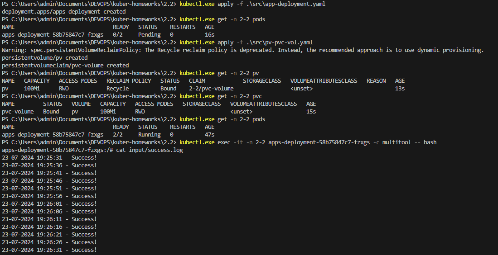
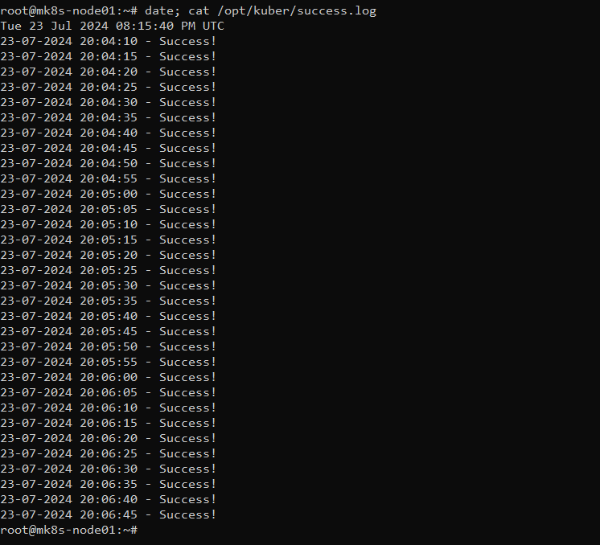
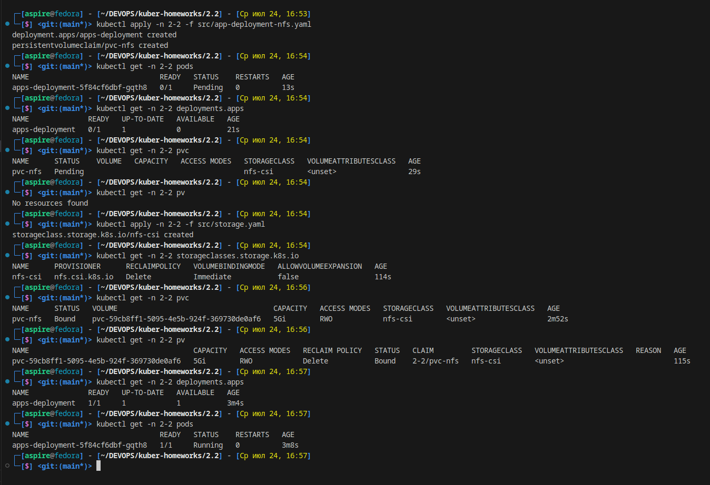
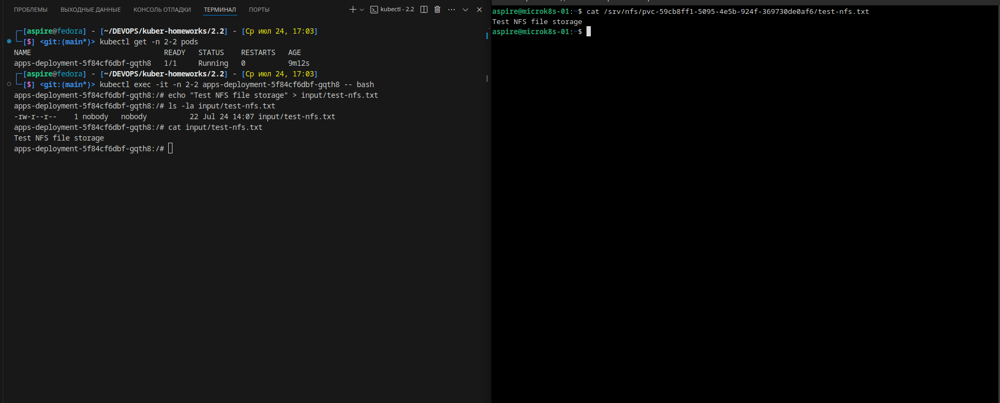

# Домашнее задание к занятию «Хранение в K8s. Часть 2»

### Цель задания

В тестовой среде Kubernetes нужно создать PV и продемострировать запись и хранение файлов.

------

### Чеклист готовности к домашнему заданию

1. Установленное K8s-решение (например, MicroK8S).
2. Установленный локальный kubectl.
3. Редактор YAML-файлов с подключенным GitHub-репозиторием.

------

### Дополнительные материалы для выполнения задания

1. [Инструкция по установке NFS в MicroK8S](https://microk8s.io/docs/nfs). 
2. [Описание Persistent Volumes](https://kubernetes.io/docs/concepts/storage/persistent-volumes/). 
3. [Описание динамического провижининга](https://kubernetes.io/docs/concepts/storage/dynamic-provisioning/). 
4. [Описание Multitool](https://github.com/wbitt/Network-MultiTool).

------

### Задание 1

**Что нужно сделать**

Создать Deployment приложения, использующего локальный PV, созданный вручную.

1. Создать Deployment приложения, состоящего из контейнеров busybox и multitool.
2. Создать PV и PVC для подключения папки на локальной ноде, которая будет использована в поде.
3. Продемонстрировать, что multitool может читать файл, в который busybox пишет каждые пять секунд в общей директории. 
4. Удалить Deployment и PVC. Продемонстрировать, что после этого произошло с PV. Пояснить, почему.
5. Продемонстрировать, что файл сохранился на локальном диске ноды. Удалить PV.  Продемонстрировать что произошло с файлом после удаления PV. Пояснить, почему.
6. Предоставить манифесты, а также скриншоты или вывод необходимых команд.

1-3. Подготовил и применил манифесты для  создания ```deployment```([app-deployment.yaml](./src/app-deployment.yaml)) и ```pv``` c ```pvc``` ([pv-pvc-vol.yaml](./src/pv-pvc-vol.yaml))



4-5. Удалил ```deployment``` и ```pvc```.


```PV``` остался доступен,  т.к. как объект он из k8s не удалялся. Файл  ```success.log``` остался доступен  на локальном диске ноды  microk8s


Удалил ```PV``` 


Файл  остался доступным на ноде, т.к. ```persistentVolumeReclaimPolicy```  было  указано  ```Retain```




------

### Задание 2

**Что нужно сделать**

Создать Deployment приложения, которое может хранить файлы на NFS с динамическим созданием PV.

1. Включить и настроить NFS-сервер на MicroK8S. - подробно описано  в доках к microk8s,  поэтому не буду засорять  скриншотами
2. Создать Deployment приложения состоящего из multitool, и подключить к нему PV, созданный автоматически на сервере NFS.

Подготовил и применил  манифесты для ```deployments```, ```pvc``` и ```storageclass```. 



3. Продемонстрировать возможность чтения и записи файла изнутри пода. 




Как видно из  скриншота файл успешно создается изнутри пода  и доступен  на ноде microk8s

4. Предоставить манифесты, а также скриншоты или вывод необходимых команд.

------

### Правила приёма работы

1. Домашняя работа оформляется в своём Git-репозитории в файле README.md. Выполненное задание пришлите ссылкой на .md-файл в вашем репозитории.
2. Файл README.md должен содержать скриншоты вывода необходимых команд `kubectl`, а также скриншоты результатов.
3. Репозиторий должен содержать тексты манифестов или ссылки на них в файле README.md.
